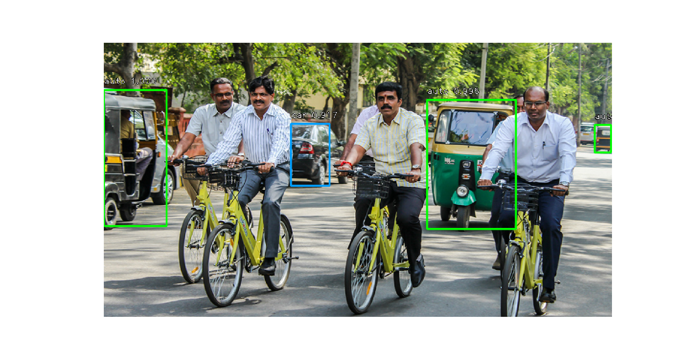
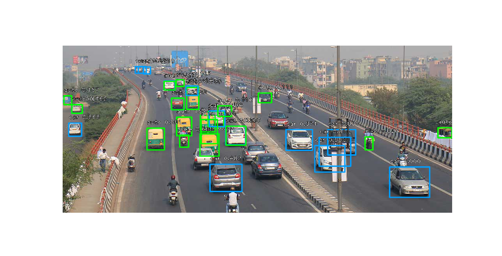
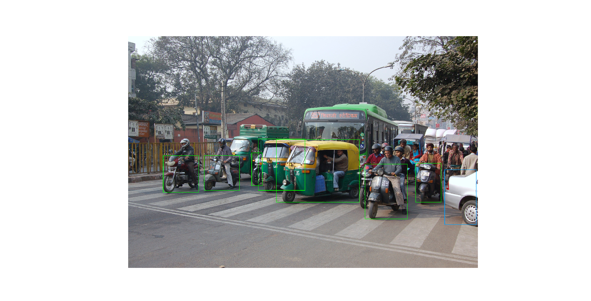
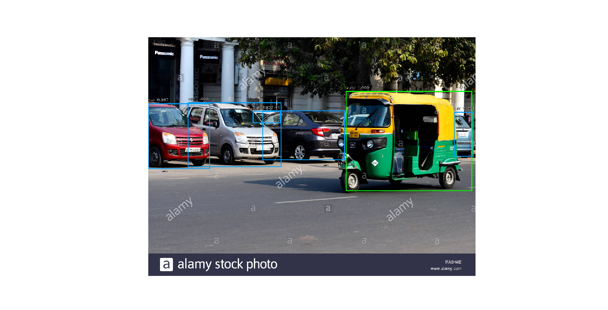
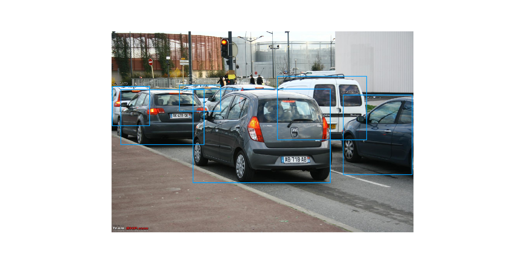

# Vehicle-Detection

## Overview

---

This project focuses on detection of 3 sets of Indian vehicles using Retinanet Model.

## Trained on

---

The model used is trained on a dataset containing three sets of Indian vehicles - Cars, Motorbikes and Autos.
The dataset comprising of about 10,000 pictures was collected manually and was labelled using tool [LabelMe](http://labelme.csail.mit.edu/Release3.0/).

## Model used

---

#### [RetinaNet](https://keras.io/examples/vision/retinanet/)

RetinaNet is a popular single-stage detector, which is accurate and runs fast.\
RetinaNet uses a feature pyramid network to efficiently detect objects at multiple scales and introduces a new loss, the Focal loss function, to alleviate the problem of the extreme foreground-background class imbalance.

Weights of trained model - /models/vds_weights.h5

## How to Run

---

### Prerequisites

- Python3
- Keras
- Tensorflow
- Keras_retinanet
- cv2

### Steps

1. Download [weights](https://drive.google.com/drive/folders/1rruFkiCkFppTsQAq8-YZO2y2WkHQBdLj?usp=sharing) and copy it to the models directory. It contains weights of the trained model.

1. Execute predict.py file.

```
python predict.py
```

3. To input an image, save the image in root directory and change the image name in function read_image_bgr in predict.py. (example - test.jpeg)

1. You can also tweak the threshold score. (Detector will only detect those images in the output where confidence score is greater than threshold.)

## Results

---






